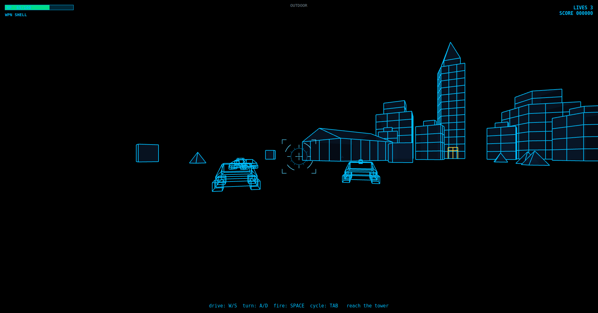
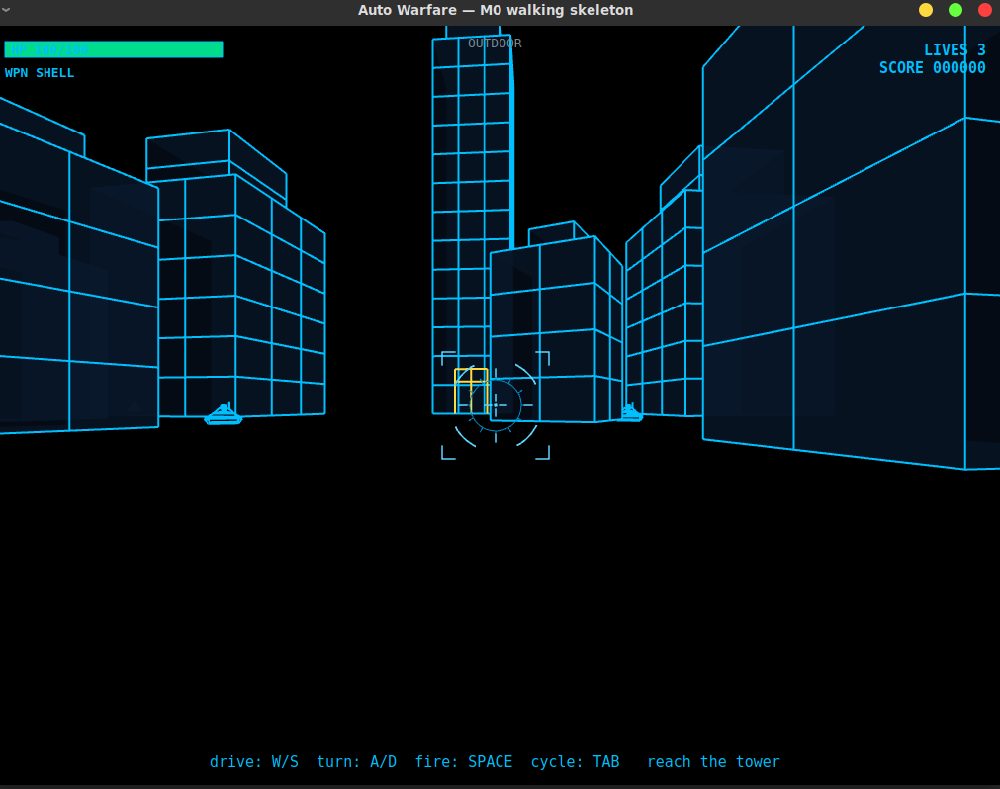
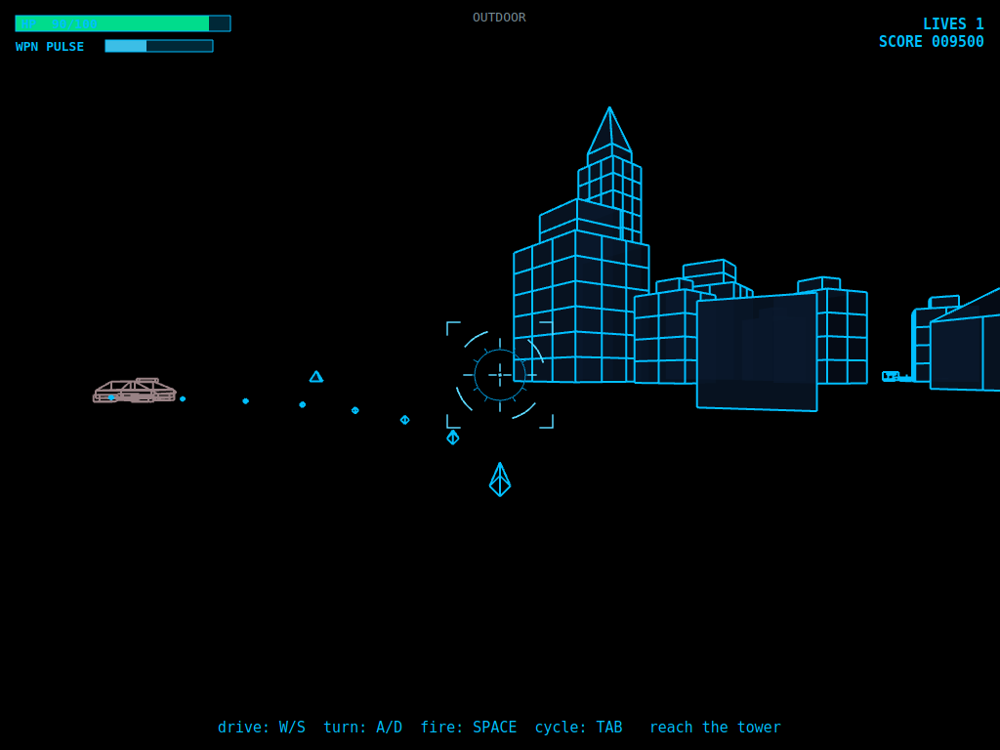
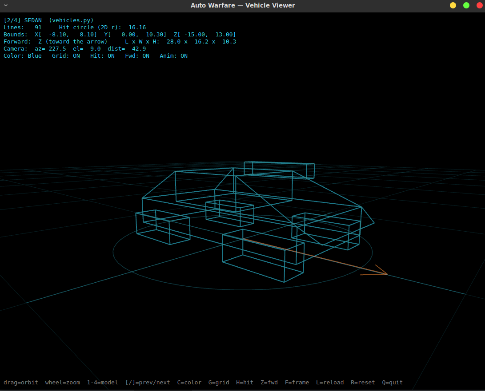
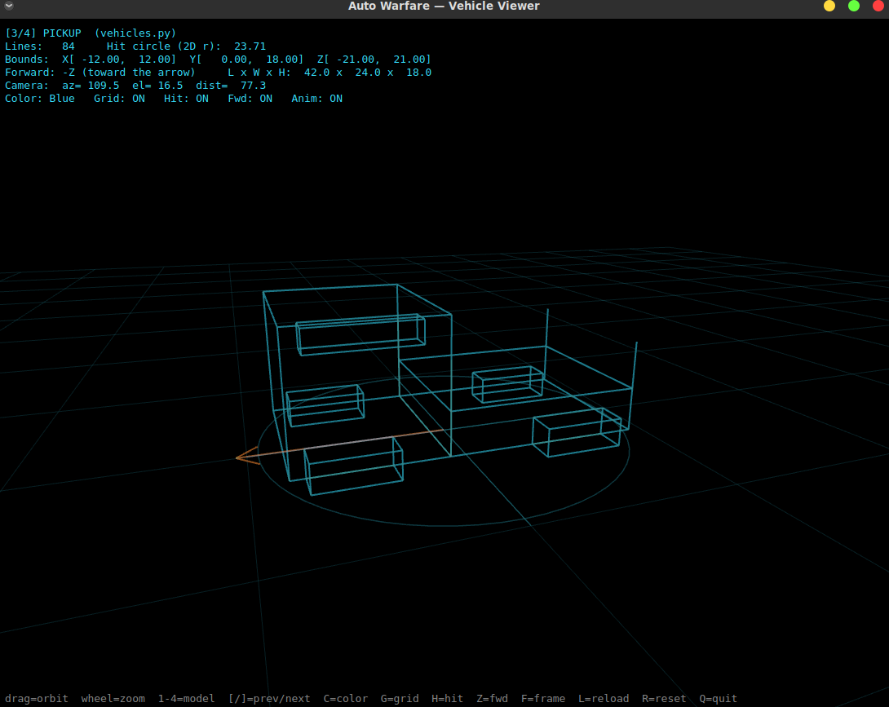
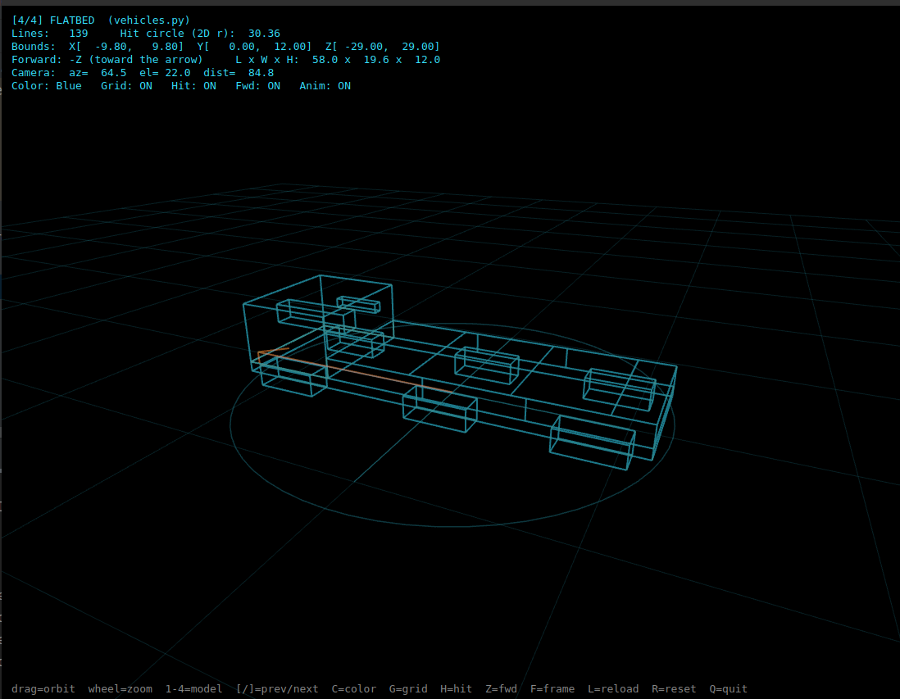
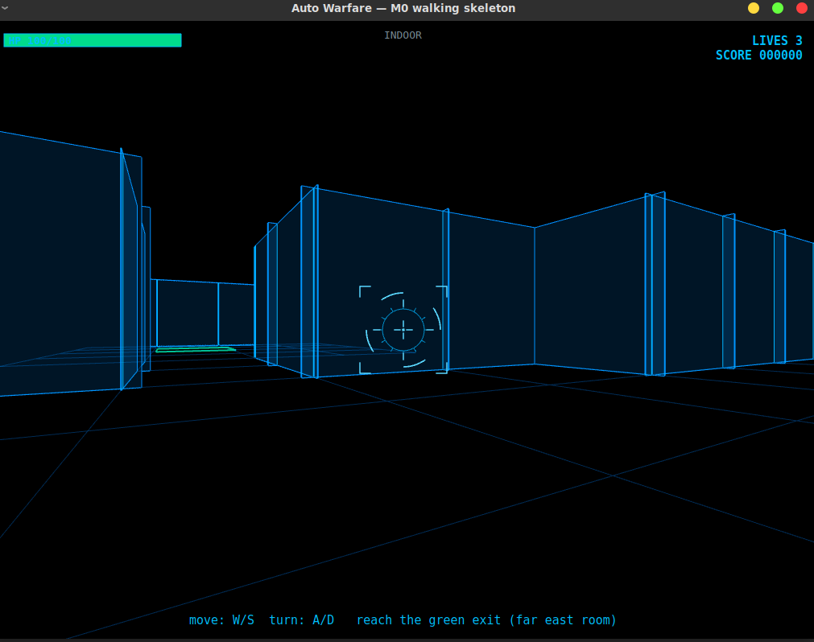
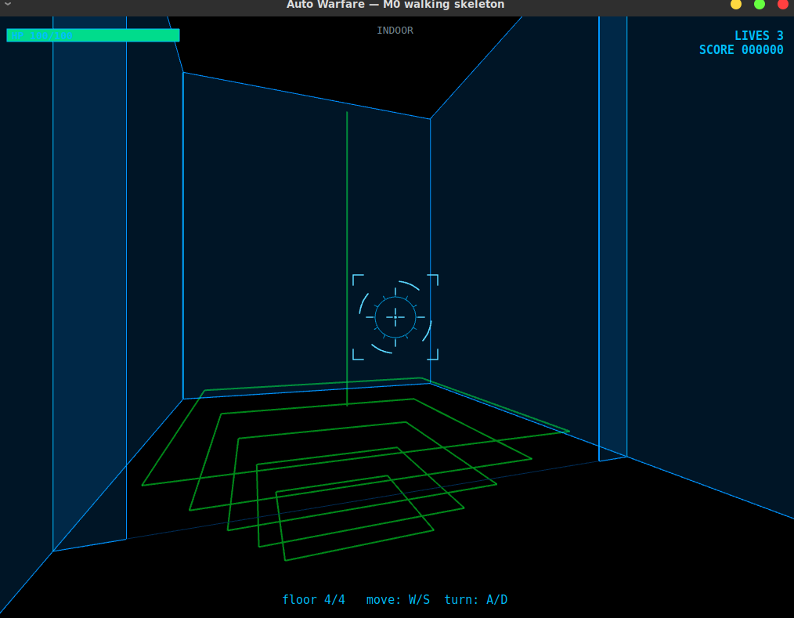
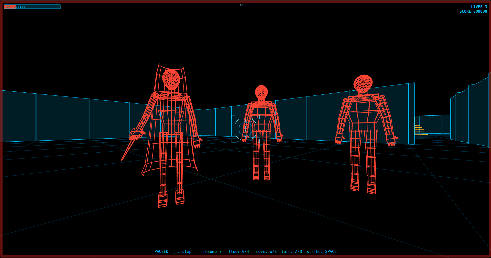

# Auto Warfare

A wireframe **Mad Max × Blade Runner** survival game: a cyberblue-phosphor
vector city you drive, fight, and search on foot — built as two very different
rendering engines hosted side by side behind one shell, sharing one game state
across a single seam.

<p align="center">
  
  <br><em>The battlefield — a dead vector city you drive across, hunting the building that hides the plant.</em>
</p>

This README is the entry point. It describes **what the project is** and **what
actually works today**, then points at the deeper design docs for the *why* and
the *how*. As of this milestone, the architecture is no longer a bet — a second,
independent engine has been integrated into the shell, the buildings it renders
are **stacks of procedurally-generated floors** you climb, and those interiors
now **fight back**.


---

# But First! 
I didn't write most of this. I architected it and evaluated every line — and the only reason that produces something coherent instead of garbage is the thirty years of reading code that lets me tell the difference
But it took many hours none-the-less... lets call it "Supervised Software Synthesis"

###
"Supervised Software Synthesis" — software produced by authoring the architecture and specification, directing a generative model to synthesize the implementation, and evaluating every line against the author's own engineering judgment. The model writes; the engineer is accountable. It is distinguished from "vibe coding" by exactly that evaluation function: it requires the literacy to tell correct from plausible, and it fails without it. -- source Claude Opus 4.8


## What it is (the frame)

Auto Warfare is a survival game wearing an arcade-combat skin. You drive an
armored auto through a dead, war-torn city looking for one thing — a
replacement **MicroNuke Power Plant** hidden in one of the buildings. Finding it
means diving buildings to search them, and every time you climb back out into
the battlefield the war has escalated. The whole map is a search problem wrapped
in a war, and the difficulty curve *is* the player's own search behavior.

<p align="center">
  
  <br><em>Driving the canyon between buildings — every skyscraper is a potential dive.</em>
</p>

That single design idea is why the game is built the way it is: there are two
worlds — an **outdoor** battlefield and **indoor** building interiors — and the
tension lives in crossing between them. The engineering exists to make that
crossing seamless and cheap to author. The full design rationale lives in
`README_AutoWarfare_Vision.md` (the *why*); this README covers the machine that
serves it.

---

## What works today (base capabilities)

The engine spine is complete and exercised by an automated test suite. Concretely:

**One shell, two engines.** A single `QOpenGLWidget` owns the process: one GL
context, one 16 ms game loop, one HUD, one player state. It hosts two completely
different renderers as interchangeable *guests*, switching between them through
a portal — neither engine owns a window, a timer, or the loop.

**The outdoor world** — a Battlezone-derived vector engine (`outerworld_engine`).
You drive an armored auto across a wide (~2000-unit) battlefield with horizon,
terrain, and wireframe buildings; fire two switchable weapons (a ballistic shell
and a heat-gated pulse rifle); and fight a **three-chassis enemy bestiary** for
score, with the war already escalating as you search:

<p align="center">
  
  <br><em>The pulse rifle mid-burst — two switchable weapons, a unified damage economy, score on the line.</em>
</p>

- **Sedan / Pickup / Flatbed.** A fast-fragile pulse-MG swarm, a slow-tough
  shell-cannon bruiser, and a medium both-weapons elite — each its own
  wireframe, HP, handling, and loadout, driven by AI. Enemies fire back through
  the *same* engine-neutral weapon abstraction the player uses, owner-tagged.

<table>
  <tr>
    <td align="center"></td>
    <td align="center"></td>
    <td align="center"></td>
  </tr>
  <tr>
    <td align="center"><em>Sedan — fast, fragile</em></td>
    <td align="center"><em>Pickup — slow, tough</em></td>
    <td align="center"><em>Flatbed — medium elite</em></td>
  </tr>
</table>

<p align="center"><em>The three enemy chassis in the model viewer — distinct silhouettes, each with its own HP, handling, and loadout.</em></p>

- **A spawn director** turns one input — a `tier` that **bumps each time you
  return from a building dive** (the Milestone-3 escalation ratchet, not a clock)
  — into how many enemies hold the field and who they are. Population rises then
  plateaus at a ceiling; the mix shifts (Sedans early, Pickups gate mid, Flatbeds
  rare and late); and the field **refills within a tier**, so a cleared area
  doesn't go quiet and farmable.
- **One unified damage economy.** Projectile damage, enemy HP (chip → kill →
  score), enemy return fire, and player damage all route through the shell's
  `PlayerState` — grace frames, lives, and a game-over freeze — so a hit *means*
  something in either world.

Drive to the landmark skyscraper and press **E** to enter it.

**The indoor world** — the *Castle of Bane* wireframe dungeon core
(`innerworld_engine`: grid `DungeonMap`, BSP-ordered walls, the `.map` cell
vocabulary), de-windowed and hosted as a shell guest, now driving **multi-floor
procedurally-generated buildings** you must search and fight through:

<p align="center">
  
  <br><em>Inside a dive — first-person grid movement through a generated floor, the green exit marking the way back to the battlefield.</em>
</p>

- **A building is a stack of floors; a floor is a grid dungeon.** Entering the
  skyscraper builds a five-floor tower you climb, walk first-person with grid
  collision and slide-along, and leave through a ground-floor exit that hands
  control back to the battlefield.
- **Floors are generated, not hand-placed.** A native seeded
  rooms-and-corridors generator (`innerworld_engine/generate.py`, built on the
  engine's own carve primitives — *no Bane generator vendored*) produces each
  floor, **solvable by construction**: rooms are joined into a spanning corridor
  chain, so the space is one connected walkable component with no
  generate-then-reject loop.
- **The building's outdoor shape drives the dive.** Its `archetype`
  (warehouse / small / large / skyscraper) sets floor count and room density;
  its `footprint` sets each floor's grid envelope; a per-building `seed` makes
  the whole stack deterministic — a half-cleared tower never reshuffles between
  dives.
- **Stairs are internal, not a portal.** A shared stairwell column links the
  floors; standing on it, **U climbs and I descends**, swapping the active
  `(dungeon, BSP)` pair and repositioning the camera *within* the indoor world.
  The portal never sees a floor change. `depth` — the highest floor reached this
  dive — falls straight out of it, and is the signal the Milestone-3 escalation
  scales on.

<p align="center">
  
  <br><em>The stairwell column — stand on it and press U / I to climb or descend, swapping floors without ever crossing the portal.</em>
</p>

- **The interior fights back.** Three baked wireframe **clone-mobsters** patrol
  the floors — a **thug** (bruiser) and a hooded **knifeman** close and slash;
  a **gunman** holds a standoff and fires a slow, *dodgeable* bolt you beat by
  breaking line of sight. Aggro is line-of-sight-gated, a crowd fans into an arc
  instead of fusing, and you fight back with a forward strike (**Space**). All of
  it routes through the same `PlayerState` damage economy as the outdoor war. The
  longer you linger on a floor, the more often the building sends
  reinforcements — **escalation over time within a dive**, so searching has a
  clock.

<p align="center">
  
  <br><em>Surrounded mid-dive — clone-mobsters fanned into a flanking arc, the building's reinforcements closing in.</em>
</p>

**The seam.** Crossing between worlds carries `PlayerState` — health, lives,
score, cleared-building ledger, inventory — and nothing else. Damage taken,
score earned, and progress all persist across the portal; coordinate systems and
vertical conventions never cross it. The outdoor auto's position is restored on
return, so the battlefield is one persistent place.

**Shared, engine-neutral systems.** Weapons/loadout, spatial queries
(collision + line-of-sight), and motion live in `common/` and are written
against neither engine, so the same weapon concept fires real (but different)
projectiles in both worlds.

What this milestone proved: a second engine with its own coordinate convention,
its own geometry pipeline, and its own combat model dropped into the shell by
satisfying three small contracts (`World`, `SpatialQuery`, a projectile
factory) — with no change to the shell, the portal, or the outdoor world — and
then *grew* a multi-floor, procedurally-generated, enemy-populated interior on
top of it without the shell or the portal learning anything new. The seam holds.

---

## Architecture in brief

The shell is the only thing that owns the runtime. Everything else is a guest.

- **`World` contract** (`shell/mode.py`) — every world implements
  `on_enter / on_exit`, `update(dt, input, state) → Transition?`, and
  `draw(viewport)`. The shell calls these; the world never reaches back.
- **One-shell rule** — a single `QOpenGLWidget` (`shell/app.py`) runs the loop:
  normalize input → `active.update(dt, input, state)` → `active.draw(...)` into
  the current GL context → a QPainter HUD pass on top. Exactly one world is
  active at a time.
- **The portal + `PlayerState`** (`shell/portal.py`, `shell/player_state.py`) —
  a `Transition` returned from `update` swaps the active world; `PlayerState` is
  the only thing that survives the swap. This is the entire cross-world economy.
- **Engines as guests** — `outerworld_engine` (Battlezone-derived vectors) and
  `innerworld_engine` (Castle of Bane dungeon core + a native generator) are
  kept as self-contained engines; the game-specific wiring that adapts each to
  the `World` contract lives in `outdoor/` and `indoor/` respectively.
- **`FloorSource` seam** (`indoor/floor_source.py`) — the interior turns
  `(archetype, footprint, seed)` into a stack of floors behind a two-method
  contract, the same one-engine-two-drivers discipline used for `World` and
  `SpatialQuery`. `ProceduralSource` (the default, generating) satisfies it
  today; a `MapFileSource` for hand-authored set-pieces is a near-free later
  addition given the engine's existing `.map` loader. Moving between floors is
  internal to the indoor world; only the **building → world** crossing is a
  portal `Transition`.
- **Coordinate sealing** — the indoor engine renders in a **-Y-up** space
  (floor `y=0`, ceiling `y<0`) and the outdoor engine in **+Y-up**; each seals
  its own convention inside its renderer, and the portal is a hard cut so the
  two never have to reconcile. (The one explicit reconciliation — a vertical
  flip in the indoor renderer — is documented at its single point of use.)
- **Fixed-timestep hosting** — engine feel-constants are authored per-tick;
  each world runs an accumulator so the sim ticks at its native 16 ms regardless
  of frame rate.

The settled technical contract (the seam, the coordinate hazards, what not to
re-litigate) is `README_POC_Design.md`. The interior plan — the floor stack, the
`FloorSource` seam, the generator — is `README_Innerworld_Design.md` and the
session-8 deep dive `README_Inner_world_design_session8.md`. The indoor combat
slice (the mobster roster, the AI, the bolt, dwell-time escalation) is captured
in `INDOOR_PRIMER.md`.

---

## Running it

From the project root (so `az` resolves as a package):

```
python -m az.main                          # run the game
python -m az.tests.test_spine              # spine: drive/fire/score/portal/weapons — headless
python -m az.tests.test_indoor_m20         # indoor base: dungeon/collision/LOS/exit — headless
python -m az.tests.test_floor_stack        # the floor stack + prompt-gated stairs — headless
python -m az.tests.test_procedural_source  # the generator + FloorSource adapter — headless
python -m az.tests.test_indoor_combat      # indoor melee: placement, chase, slash, strike — headless
python -m az.tests.test_indoor_ranged      # the gunman: standoff, LOS-gated fire, bolt flight — headless
python -m az.tests.test_indoor_escalation  # dwell-time reinforcement waves — headless
```

Controls: **W/S** drive or walk · **A/D** turn · **Space** fire / indoor strike ·
**Tab** cycle weapon · **E** enter the tower / leave through the exit ·
**U / I** take the stairs up / down (on the amber stairwell column) ·
**`` ` ``** pause · **`.`** step one frame while paused · **P** screenshot.

Requires Python 3.11+, `PyQt6`, and `PyOpenGL`. The automated tests are
headless (no GL/Qt context); the one thing they can't verify is live rendering,
so visual changes are signed off by running the window.

---

## Project layout

```
az/
  shell/            the runtime spine — app, World contract, portal, PlayerState, pause/step
  common/           engine-neutral systems — weapons, spatial queries, motion, models
  hud/              the HUD compositor (reads PlayerState)
  outdoor/          the outdoor world wiring (adapts outerworld_engine to World)
    world.py            OutdoorWorld — drive/fire loop, damage routing, the lobby portal
    vehicles.py         the three enemy chassis as data (model + hp + handling + loadout)
    director.py         the tier-driven spawn director (population, mix, refill)
    weapons.py          player + enemy weapon/projectile factories
  outerworld_engine/  Battlezone-derived vector engine — tanks, AI, terrain, render
  indoor/           the indoor world wiring + de-windowed renderer + combat
    world.py            IndoorWorld — floor stack, stair swap, collision/LOS, exit, combat, escalation
    floor.py            FloorRuntime — one level: dungeon + lazy BSP + landings + entities + enemies
    floor_source.py     FloorSource seam + ProceduralSource (archetype/footprint gradient)
    placement.py        objectives decorator — plant (deep) + intel (early), deterministic
    enemy_placement.py  enemy decorator — tier-scaled placement + reinforcement spawn helpers
    enemies.py          EnemyDef table — thug / knifeman / gunman (Bane stats → indoor units)
    mob.py              Mob runtime + melee/ranged AI (LOS aggro, slide-along, slash, kite)
    projectile.py       the gunman's slow, dodgeable bolt
    renderer.py         stateless wireframe interior draw (walls, markers, mobs, bolts)
    models/mobsters.py  baked, numpy-free mobster wireframes (regenerated by tools/bake_mobsters)
  innerworld_engine/  Castle of Bane dungeon core — grid, BSP, level vocabulary —
                      plus generate.py, a native seeded rooms-and-corridors generator
  tools/            design-time tooling — humanoid generator, mobster viewer, the baker
  tests/            headless acceptance tests
  main.py           entry point
```

---

## Status & roadmap

- **M0 — walking skeleton** ✅ drive outdoor, enter a placeholder interior,
  return; the one-shell loop and portal proven.
- **M1 — combat abstraction** ✅ engine-neutral weapons/loadout (ballistic shell
  + heat-gated pulse, switchable); a unified damage economy (enemy HP, enemy
  return fire, player damage → lives → game-over); a three-chassis enemy bestiary
  (Sedan / Pickup / Flatbed) driven by AI; and a tier-driven spawn director
  (stepped population plateau, gated mix, within-tier refill).
- **M2.0 — Bane integration** ✅ the real dungeon engine vendored and de-windowed
  as a guest; first-person movement, occluding wireframe render, portal
  round-trip. *Architecture proven.*
- **M2.1 — interior structure** ✅ buildings are stacks of procedurally-generated
  floors shaped by archetype/footprint/seed; a `FloorSource` seam (generating
  driver now, file-backed driver later); internal prompt-gated stairs (U/I); and
  `depth` (max floor reached) tracked as the M3 escalation signal. Solvable by
  construction; deterministic per building.
- **M2.2 — indoor melee** ✅ grid line-of-sight enemies — the thug and knifeman
  close and slash, damage routed through the shell's `PlayerState`; a player
  forward-strike; and inter-mob separation so a crowd flanks instead of fusing.
  Three baked, numpy-free mobster wireframes designed in a dedicated viewer.
- **M2.3 — the gunman + escalation** ✅ the ranged gunman: standoff/kite
  positioning and a slow, dodgeable bolt the world flies (beaten by breaking
  LOS); and **dwell-time reinforcement** — a building sends mobs onto your floor
  faster the longer you linger, the intra-dive ramp that composes with the
  cross-dive `tier`. Plus a shell-level pause / frame-step for inspection.
- **M3 — the loop** ⏳ the search economy. The escalation *skeleton* runs — the
  spawn director plus a `tier` that bumps on return-from-dive (placeholder), and
  now the intra-dive heat inside a building. The **outcome payload**
  (`cleared` / `depth` / `found` / `hint`) is reported by the exit `Transition`,
  and the **plant / intel placement** decorator is in (the win object biased
  deep, the hint biased early). Pending: the win-condition resolution, richer
  reinforcement-on-return, and the ratchet that turns interior results into
  battlefield escalation for real (it bumps `tier` in placeholder form today).

---

## Documentation map

- **`README.md`** (this file) — what it is, what works, how it's built, how to run.
- **`README_AutoWarfare_Vision.md`** — the game design and the *why*: the search
  loop, the escalation economy, the tone. The living compass.
- **`README_POC_Design.md`** — the settled technical contract: the seam, the
  coordinate hazards, the one-shell rule. How the pieces bolt together.
- **`README_Innerworld_Design.md`** / **`README_Inner_world_design_session8.md`**
  — the interior: the Bane-engine port, the floor stack, the `FloorSource` seam,
  the procedural generator, and the build order toward the M3 outcome payload.
- **`INDOOR_PRIMER.md`** — the indoor combat slice and the next-session TODO:
  the mobster roster, the melee/ranged AI, the bolt, dwell-time escalation, the
  tuning dials, and the open items (first-person staff overlay, kill scoring).
- **Session primers** — per-session onramps written from the docs above when a
  milestone becomes the active work.